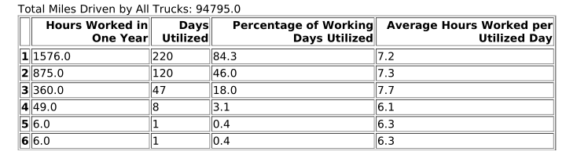
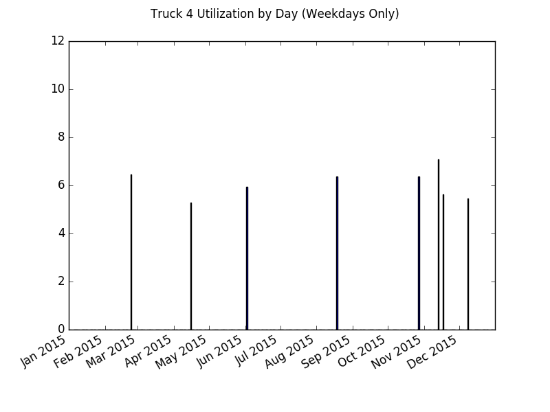
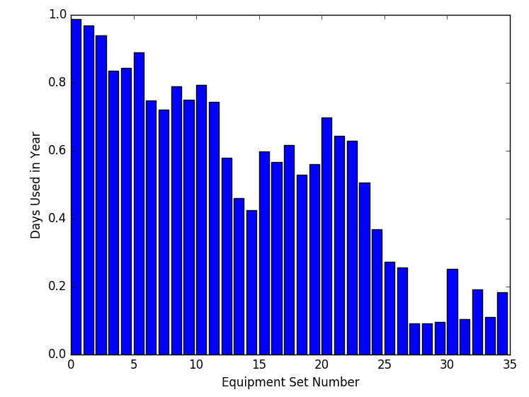
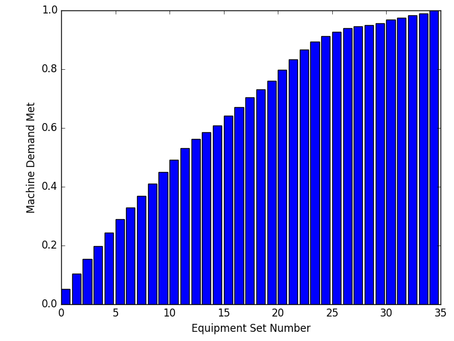

.. _reporting:

Reporting Our Results
=====================

Upon completion of the hauler routing for every day in our data set, we are
left with three complete pieces of information as our results.

    * how much demand each site had each day (smoothed)

    * how many miles the fleet of haulers traveled each day

    * how many hours each hauler worked each day

All of this information we then compile into a report which can then be used
to make a calculation of the cost of this variation's delivery system. 

Equipment Hauler Cost
---------------------

The first step in the reporting process is to summarize how often each hauler
is utilized. Each day when we recorded the hours each hauler worked, we
assigned hours to haulers from greatest to least, so the first hauler got the
most hours, the second got the second most, etc. By doing this, when we
average how many hours each hauler works each day and how many days in a time
period each hauler worked, we ensure the fewest amount of haulers do the greatest
amount of work. Based on how often each hauler is utilized, a decision can be
made as to whether or not that hauler needs hired and his semi needs purchased,
or if overtime by other haulers can be worked to cover the extra drop-offs
and pick-ups. Later in the reporting process, this decision can be reinforced
by graphs mapping out how much each hauler works on each day, telling us
whether or not such an overtime strategy would be effective in replacing a
given equipment hauler. With this information we can calculate the cost to
staff the required number of equipment haulers, the first required piece of
information in estimating cost.

For example, the image below illustrates what the results of this summary
might look like. It's pretty easy to tell that the last three haulers
probably do not need hired. The second image typifies the graph that maps
how much each hauler works each day, and supports the last three not being
hired as :math:`4`'s hours are pretty spread out, could be covered by another
hauler working extra, and are greater than :math:`5`'s and :math:`6`'s.

Semi-Truck Cost
---------------

Next we can induce how much should be spent on equipping our haulers with semi-
trucks. We already know how many trucks will be needed (as we would like one
for each hauler), but another part of the cost comes from how often we have
to replace the semi-trucks based on how many miles they run per period of
time. This part of the calculation begins by summing the total number
of miles the fleet runs each day for our time period. An example of this
number appears at the top of the first image. Then taking the ratio of fleet
expected lifetime mileage and time period mileage yields how many time periods
the fleet can run before replacement. Knowing the size of our fleet and how
often it needs replaced, we can infer costs for our semi-trucks, our second
crucial piece of information.

Equipment Sets Cost
-------------------

One final crucial piece of information has yet to be determined for making
our cost calculation, and that is how many sets of equipment will be needed
for this system to work. For each day in our time range, we repeated the
following process:

1. If a set of equipment is at a site, mark it as in use. If it gets
   picked up from that site later in the day, it is still being used as it
   either goes to another site or spends the day returning to the hub.

2. If a site has a demand for equipment to be picked-up, assign that
   number of that site's sets of equipment to be free for usage elsewhere.

3. If a site has a demand for equipment to be dropped-off, assign that
   number of sets of equipment to that site. This can include
   the sets of equipment that were just released, as haulers can meet one
   site's demand for drop-offs by picking-up from a site that released
   equipment on that day.

4. If a set of equipment is at a site, mark it as in use. We repeat this
   step to ensure that additional sets of equipment that were brought out
   to job sites, if necessary, are counted as in use.

Also worth noting in the process, the sets of equipment are indexed in
increasing order, and assignment is made to the set of available equipment
with the lowest index, ensuring we use the smallest number of equipment sets
for the majority of the work.

From here we make two graphs to illustrate the machine set usage. The first
graph depicts how often each set of equipment gets used, helping us decide
whether or not a given set of equipment should be bought or rented. The
second graph shows us how much additional utility each set of equipment adds,
further detailing how many equipment sets are needed to meet the demand. With
this information, we can now infer how many sets of construction equipment
are needed as well as how much each set will cost (renting/buying is determined
by a utilization threshold, anything below is rented and above is bought). An
example of the first graphic is shown below, followed by an example of the
second. With an idea in hand of what threshold of utilization is needed to buy
a set of equipment vs. rent it, we can calculate a total cost for the sets of
equipment required by the delivery system.

Decision
--------

At this point, all of the above information is compiled into a single report
corresponding to the given variation of a region, and can be used to calculate
the cost of this variation's delivery system subject to the time window used.
For an example of what a complete report looks like, I invite you to download
:download:`topeka_base_report.pdf <topeka_base_report.pdf>` (available for
download at https://github.com/spkelle2/Equipment_Routing if you're reading
from a pdf). Finding the minimum
cost of all variations and time windows tested for a given geographical region
reveal to us the estimated cost of investment for the internal delivery system.
In the case of the construction company, comparing these minimum costs to the
current cost of operation in each of their geographical regions was used to
determine if the internal delivery system was desirable.

In summary, the results of all the code and models are accurate estimates of
the investments an organization would need to support a single, large
commodity delivery network. These investments can be clearly interpreted by
means of the graphs compiled in the output report. With a full means now of
understanding how a decision can be made, I invite you to look at my closing
remarks on the project.

Continue to :ref:`conclusion`

Documentation
-------------
Report generator:

.. autofunction:: reporting.make_report

Summarization of hauler utilization:

.. autofunction:: reporting.summarize

Bar graph for daily hours of a hauler:

.. autofunction:: reporting.hauler_graph_maker

Equipment set utilization:

.. autofunction:: reporting.equipment_usage_analysis

Equipment set utilization graphs:

.. autofunction:: reporting.equipment_graph_maker

